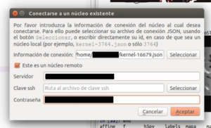

Bueno, pues hoy os voy a contar como utilizar **Spyder** para conectarse a un **kernel remoto de IPython**, por ejemplo, para realizar tareas que requieran una gran cantidad de RAM o de tiempo de procesamiento en un servidor. El proceso consta básicamente de dos pasos: **lanzar el kernel en el servidor** y **conectarse a él desde Spyder**.

#### Lanzar un kernel en el servidor

Para lanzar el kernel en el servidor, el proceso dependerá de cómo estemos habituados a realizar la conexión. Normalmente yo recomiendo utilizar \`ssh\` para la conexión por su seguridad y porque es la que utiliza el propio Spyder. En cualquier caso, utilizando ssh, la conexión se realizaría:

ssh usuario@servidor

Tras conectar al servidor, lanzamos un kernel de IPython (para ello debemos tener instalado Python e IPython en el servidor) con el comando:

ipython kernel

Tras lanzar el kernel nos aparece un texto parecido a esto:

Es importante el último número que nos aparece, en nuestro caso kernel-17478.json. Este será el archivo que vamos a utilizar para conectarnos al kernel desde Spyder. Hay que puntualizar que una vez que nos conectemos a este kernel solo podremos acceder a los datos de la máquina en la que se está ejecutando el kernel, y no de nuestra máquina local.

#### Conectarse a un kernel existente desde Spyder

Para conectarse al kernel existente, debemos descargarnos el archivo kernel-17478.json que hemos descrito anteriormente. En una instalación linux Ubuntu, ésta se suele encontrar en la carpeta /home/mi\_usuario/.local/share/jupyter/runtime (en caso del IPython 4.0). Esta ruta puede variar según la versión del sistema operativo, python e IPython, por lo que es recomendable comprobarlo con anterioridad.

**EDIT**: si no se localiza, se puede acceder a la ruta donde están los kernel mediante el comando:

jupyter --runtime-dir

Una vez que estemos en esa carpeta y nos hayamos descargado el archivo kernel-xxx.json, lo copiamos en un directorio de nuestra máquina local y abrimos  Spyder.

Encima de la ventana de la terminal de IPython, justo en la esquina superior derecha, aparece una pestaña desplegable. Abrimos y pulsamos “Conectarse a un núcleo existente”. Esto abre una ventana emergente, que será similar a esta:

Una vez allí, seleccionamos el archivo .json que hemos descargado al principio y rellenamos nuestros datos de conexión (usuario@servidor, contraseña), y al pulsar Aceptar ya nos habremos conectado al kernel remoto.

Es importante notar que el kernel no se puede cerrar desde la terminal SSH, sino que debemos hacerlo desde nuestra máquina local. Para terminar la ejecución del kernel, escribimos en la terminal de Ipython:

exit()

Y así se cierra del todo.
